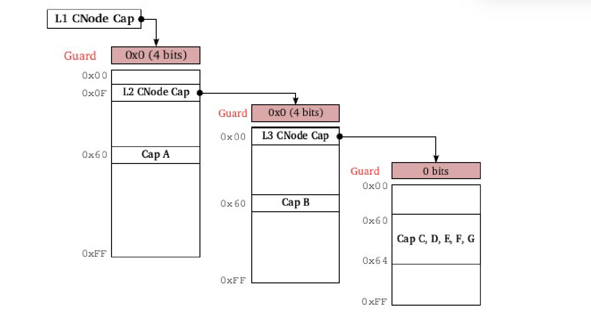

# Task Helper

Task Helper 帮助创建一个新的 Task。这个 crate 向外提供多个接口

## Sel4TaskHelper

Sel4TaskHelper 可以帮助构造一个新的 task 结构，或者可以直接使用构建任务。

```rust
/// Help to create a new task quickly.
pub struct Sel4TaskHelper<H: TaskHelperTrait<Self>> {
    pub tcb: sel4::TCB,
    pub cnode: sel4::CNode,
    pub vspace: sel4::VSpace,
    pub mapped_pt: Arc<NotiMutex<Vec<sel4::PT>>>,
    pub mapped_page: BTreeMap<usize, sel4::Granule>,
    pub stack_bottom: usize,
    pub phantom: PhantomData<H>,
}
```

| field | description |
| --- | --- |
| tcb | tcb Capacity 参考 sel4::TCB |
| cnode | cnode Capacity 参考 sel4::CNode |
| vspace | vspace Capacity 参考 sel4::VSpace |
| mapped_pt | 已经映射的 PT 结构， 在映射 page_table 的时候需要先映射 pt，映射的 pt 会存放在这里，以便任务结束时释放 |
| mapped_page | 已经映射的 SmallPage 别名为 Granule，是 map 结构，映射的地址为 key(4k 对齐)，page cap 为值 |
| stack_bottom | 当前栈底，这里适用于初始化栈赋值和更新 |
| phantom | 对 trait 实现进行存储，参考 rust PhantomData |


这个结构体包含多个较为通用的方法

### Sel4TaskHelper::new

```rust
pub fn new(
        tcb: sel4::TCB,
        cnode: sel4::CNode,
        fault_ep: sel4::Endpoint,
        vspace: sel4::VSpace,
        badge: u64,
    ) -> Self
```

这个方法可以根据指定的 Cap 中创建新的 Task，**badge 是对 fault_tp 添加的标识，在这个 task 的 fault_ep 发生 ipc 的时候会携带这个信息。** 

### Sel4TaskHelper::map_page

```rust
pub fn map_page(&mut self, vaddr: usize, page: sel4::Granule)
```

map_page 映射一个 page 到指定的虚拟地址，vaddr 就是需要映射的地址，page 就是需要映射的 page cap, page 需要为 Granule 类型，这个类型是 SmallPage 的别名。

### Sel4TaskHelper::map_elf

```rust
pub fn map_elf(&mut self, file: ElfFile)
```

map_elf 方法可以将指定的 elf 文件映射到当前 task 对应的 vspace 中，并设置上下文为 elf 文件中指定的信息和 TaskHelperTrait 中指定的信息（程序入口、栈 SP、 tls、参数）

file 类型为 ElfFile，参考 xmas_elf crate.

### Sel4TaskHelper::init_ipc_buffer

```rust
pub fn init_ipc_buffer(&mut self) -> (usize, Granule)
```

init_ipc_buffer 方法初始化 ipc_buffer，并映射对应的页表，并返回 ipc_buffer 的虚拟地址和 page cap。


### Sel4TaskHelper::configure

```rust
pub fn configure(&mut self, radix_bits: usize) -> Result<(), Error>
```

configure 方法为创建任务后必须执行的方法，**radix_bits** 为 CNode 中所有的节点占用的 bit。这个机制类似于页表



这里的 radix_bits 为所有 level 的 radix_bits + guard_bits。

### Sel4TaskHelper::map_stack

```rust
pub fn map_stack(&mut self, page_count: usize)
```

map_stack 方法可以在当前 vspace 中映射栈，page_count 为需要映射的 page cap 数量。调用这个方法映射的 page 也会存储在 mapped_page 中。

### Sel4TaskHelper::abs_cptr

```rust
pub fn abs_cptr(&self, cptr_bits: CPtrBits) -> AbsoluteCPtr
```

abs_cptr 可以获取任务所在的 cpsace 中特定 slot 的绝对位置 AbsoluteCPtr.

## TaskHelperTrait

trait 结构如下。

```rust
/// The Trait the help task implement quickly.
pub trait TaskHelperTrait<V> {
    type Task = V;
    /// The address of IPC buffer.
    const IPC_BUFFER_ADDR: usize;
    /// The default stack top address.
    const DEFAULT_STACK_TOP: usize;
    /// Get the address of the empty seat page.
    fn page_seat_vaddr() -> usize;
    /// Allocate a new page table.
    fn allocate_pt(task: &mut V) -> sel4::PT;
    /// Allocate a new Page.
    fn allocate_page(task: &mut V) -> sel4::Granule;
}
```

page_seat_vaddr 为一个空的页表位置，方便映射并写入数据。

一个参考实现。

```rust
pub type Sel4Task = Sel4TaskHelper<TaskImpl>;

pub struct TaskImpl;

impl TaskHelperTrait<Sel4TaskHelper<Self>> for TaskImpl {
    const IPC_BUFFER_ADDR: usize = 0x1_0000_1000;
    const DEFAULT_STACK_TOP: usize = 0x1_0000_0000;
    fn page_seat_vaddr() -> usize {
        page_seat_vaddr()
    }

    fn allocate_pt(_task: &mut Self::Task) -> sel4::PT {
        alloc_cap::<cap_type::PT>()
    }

    fn allocate_page(_task: &mut Self::Task) -> sel4::SmallPage {
        alloc_cap::<cap_type::SmallPage>()
    }
}
```

后续可以直接使用 Sel4Task 作为结构体使用了。
