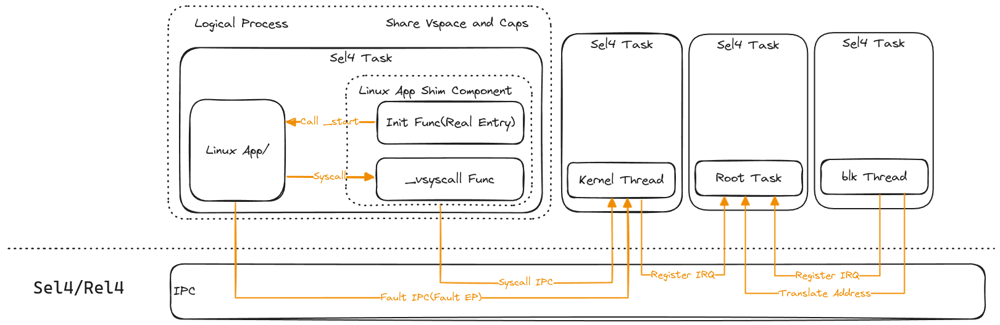

# 在 Sel4 上支持 Linux App

## 架构设计



## Root Task

内核线程，这个线程拥有最大的权限和最多的资源。其他 Task 都是由这个 Task 创建。其他任务需要一些操作就需要向这个 Task 传递信息，例如需要注册中断，就需要将需要注册的中断号和相应的 Empty Slot 位置通过 IPC 发送 RegisterIRQ 进行注册。

有些需要注意的地方，Root Task 最早是由内核创建并映射相应的页表和创建 CSpace, 默认情况下 CSpace 只有一级，12 bits, 所以只有 4096 个 slot, 而页表是 4k 映射的, 所以 Root-task 的大小最好不要超过 16M，否则需要去改内核的一个 CONFIG_xxx 去扩展 Root Task 的 bits. 目前已经将 RootTask 进行了扩展。变为两级，共有 4096 * 4096 个 slot, 目前够用，后续不够可以继续扩展。但是扩展是发生在 RootTask 启动之后，所以 RootTask 的大小限制依旧存在。

可以再扩展 fs 相关的线程，后续信息从 fs 中读取，尽量不要让 root-task 携带太多的 elf 文件数据。

## Kernel Task

内核线程目前包含简单的功能，能够从 elf 文件中创建一个任务。将 shim-comp 和一个简单的 Linux App 放在同一个任务中，初始化程序信息。能够接收简单的 IPC Call。这里面也包含一个 irq test，能够接收到键盘中断。

## virtio blk task

这个线程运行了 virtio task 的任务，能够读取 virtio 磁盘数据，能够支持中断。

## Shim Component

兼容层，Shim Component 作为真正的入口，在进入 Shim Component 的时候会接收到内核传递的信息

```rust
fn main(
    ep: Endpoint,
    ipc_buffer: IPCBuffer,
    busybox_entry: usize,
    vsyscall_section: usize,
) -> usize{
    ...
}
```

在这里会将真正 vsyscall 真正的入口写入到应用程序中 vsyscall 的指针中，后面由我们编写的 vsyscall 处理程序接收 syscall 信息并转发为 ipc call 发送出去。

需要注意的信息，由于 rust-sel4 和 LinuxApp 都用到了 tls 相关的寄存器，所以进入 vsyscall 的时候需要保存 LinuxApp 的 tls，处理完毕后恢复上下文。