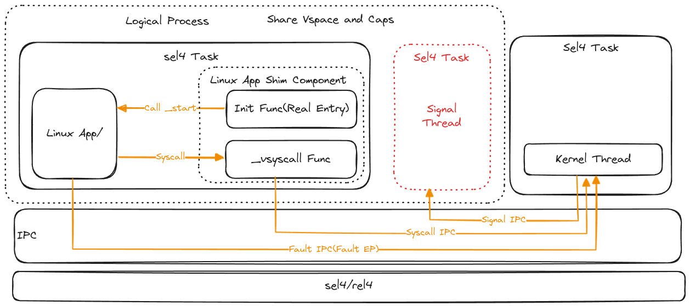
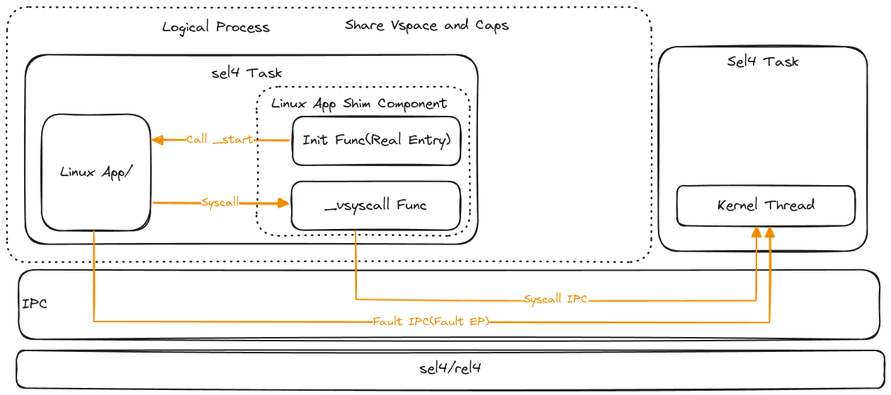

# Sel4-Based Kernel

## 架构设计




## 内核线程

内核线程也是 Root Task, 这个线程内拥有所有的资源。在内核线程中实现 POSIX 兼容的 IPC_Call, 可以将一个已有的 OS 运行在这个线程中。当内核需要创建一个新的进程的时候，会创建一个线程和一个信号线程。并分配相应的 VSpace 和 EndPoint Cap, 进行会将两个 Elf 文件映射到同一个地址空间，一个是 Linux App， 一个是 Linux App Shim Component。进程的入口为 Init Func。内核初始化完毕后，会进入一个循环，循环中接收 IPC 消息，如果收到消息，判断消息类型并处理。

**Additional: 可以将与 Sel4 相关的函数和调用封装到 HAL 层，让更多的 OS 更容易接入到 Sel4 中。**
## 程序线程

程序线程分为两个部分，第一个部分是使用特定 GCC 编译的应用程序，这个程序调用 syscall 不进入内核态，而是调用 _vsyscall 这个函数。另一个部分是使用 Rust 编写的 Linux App Shim Component (基于 Rust-Sel4)，这部分主要包含两个函数，Init 和 _vsyscall，Init 函数是 Sel4 Task 的入口，在这个函数中会初始化任务信息，并构建 Libc 需要的 args, env, auxv 等信息，**在进入 Linux App 之前需要保存 tls 寄存器，Rust-Sel4 使用 TLS 寄存器保存关键信息，和 Linux App 的 tls 冲突。** _vsyscall 函数为 Linux App 调用 syscall 的时候调用的函数。在这个函数中会将 Linux App 传递的 Syscall 寄存器通过 IPC 发到内核线程。内核线程中处理完毕后返回处理结果到 _vsyscall 函数中，再返回到调用 _vsyscall 的下一个位置。**进出 _vsyscall 函数也需要保存 tls 寄存器，aarch64 为 TPIDR_EL0**

Sel4 支持 Fault EP，当前线程发生中断时，Sel4 内核会在指定的 Fault EP 中写入特定的 MessageInfo 传递线程的错误信息，并阻塞当前线程。可以在内核线程中处理相应的错误后，恢复错误线程。

```rust
let (message, badge) = ep.recv(());
debug_println!(
    "recv message: {:#x?} length: {}",
    message.label(),
    message.length()
);

// Ensure message is fault.
assert!(message.label() < 8);
if message.label() <= 8 {
    let fault = with_ipc_buffer(|buffer| Fault::new(&buffer, &message));
    if let Fault::VMFault(_) = fault {
        // TODO: Map if the fault address is valid but not mapped(COW).
        ep.nb_send(MessageInfo::new(0, 0, 0, 0));
        tcb.tcb_resume();
    }
    debug_println!("fault: {:#x?}", fault);
} else {
    // TODO: Message is a custom message
    //       Maybe Syscall Or Others.
}

```

## 信号

### 信号处理机制

在宏内核中，信号是在特定情况下产生，在即将从内核态回到用户态的时候检查当前线程是否有需要处理的信号，如果有，则保存当前上下文，跳转到信号处理函数，并传递信号相关信息（可能包含保存的上下文，保存在栈中），处理完毕后，恢复栈中的上下文。

### 信号线程 (Sginal Thread)

信号线程在内核中创建进程 (Logical Process) 的会进行创建，在进程销毁的时候同时进行销毁，即信号线程和进程的生命周期保持一致。

信号线程中存在一个轮询函数调用 IPC Recv 接收由内核传递过来的 IPC 信息并进行处理，当当前进程需要处理信号的时候，会由 Kernel Thread 发送特定的 IPC 到 信号线程，由于信号线程和进程内的其他线程共享地址空间和 Cap，所以可以在这个函数内直接调用使用 sigaction 注册的信号处理程序。这种情况对于一些比较复杂的情况可能会比较难以处理，如对当前线程的上下文进行获取和修改，以更改程序的运行位置。对于单核来说，当调用信号线程的时候就意味着进程内的其他线程都处于 Pending 状态，且上下文不会再变化。**对于多核环境来说，调用信号线程不一定意味着能获取到不再变化的上下文。**

### 无信号线程的设计



因为在宏内核中，每个线程都有自己的信号屏蔽字和 tls（虽然可以通过修改上下文解决这个问题），所以将所有信号交于一个独立的信号线程处理并不是一种明智的行为，在单核情况下，当进入到内核线程中的时候就意味着所有的线程都处于 Pending 状态，可以直接由内核线程修改其他线程的上下文，这和宏内核几乎是一致的行为。但是对于多核情况下，可能存在要处理信号的线程和内核线程同时运行的情况。
